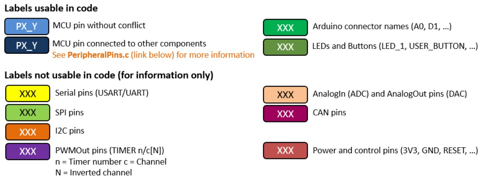
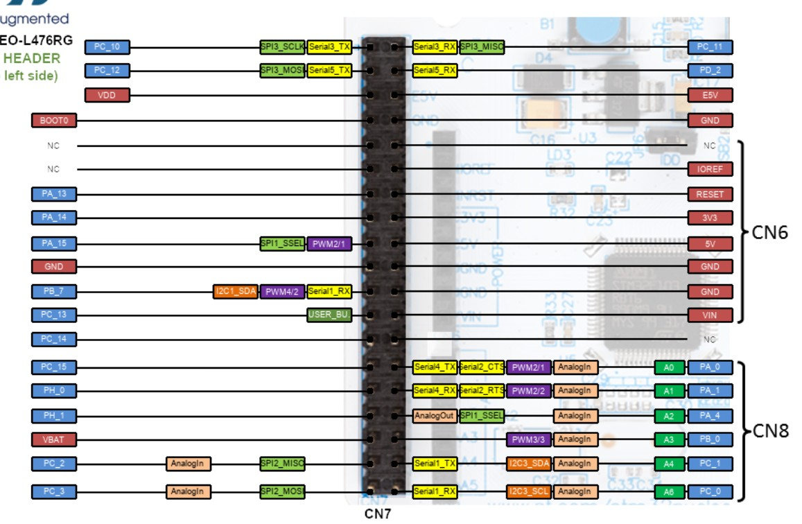
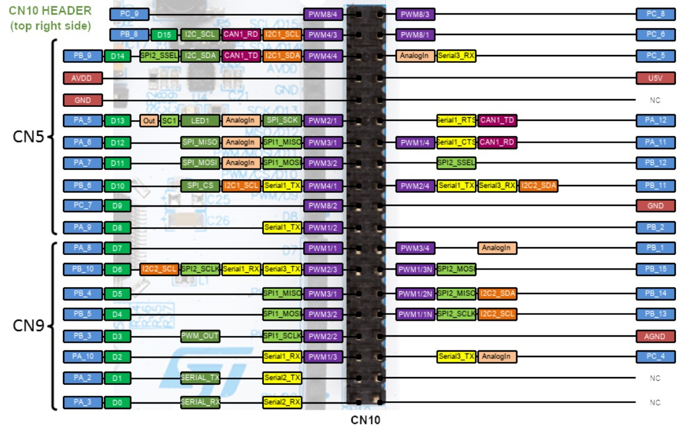
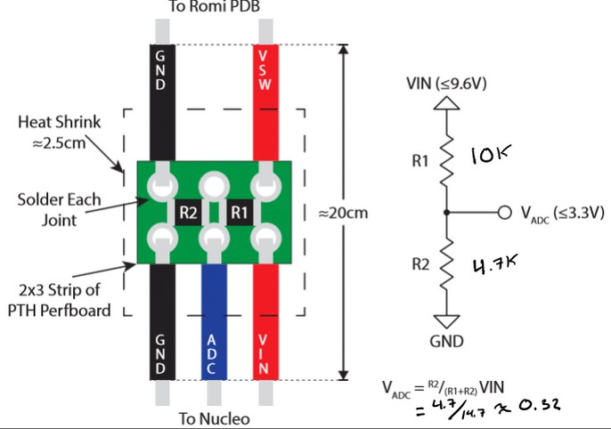
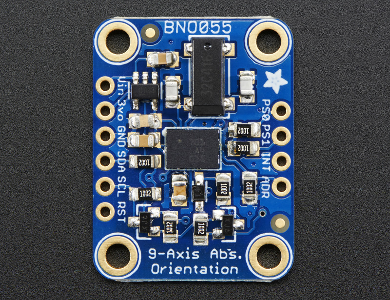
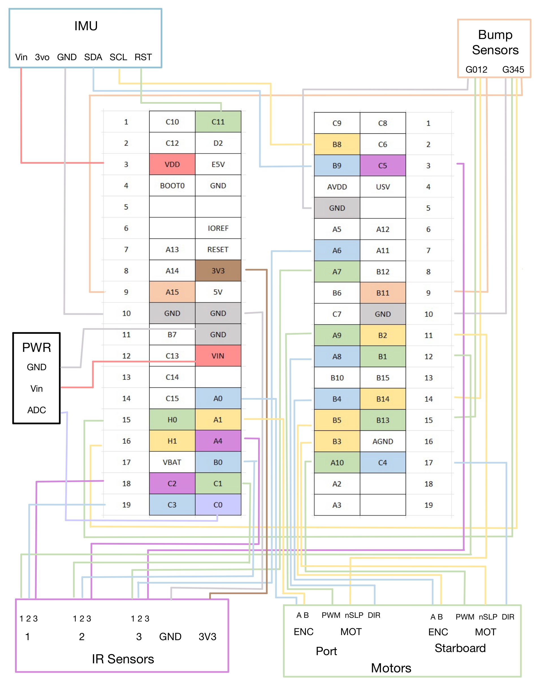

#Electrical Design

Our Romi’s electrical system was developed in parallel with software, with constant iteration between the two. As additional subsystems were integrated—including three distinct sensor types and dual motor–encoder pairs—the wiring complexity increased quickly. To manage this, we enforced a consistent color-coding scheme and maintained a detailed Excel sheet to track every connection. The Nucleo L476RG board (featuring the STM32L476RG microcontroller) provided a well-documented, color-coordinated pin layout, which we used extensively to guide pin selection and prevent conflicts. 

### Nucleo L476RG Pin Designation With Color Code 

&#x20;  

  
  

These references outline pin functionality and layout. We relied on them throughout development to ensure each component was assigned appropriate and compatible pins. Our wiring was organized into four primary subsystems: 

### Motors and Encoders 

Each wheel includes both a motor and an encoder, requiring multiple PWM and digital output pins. The encoders on each side required separate timers, with an additional timer used for the motors. We selected pins using Timers 1, 2, and 3, and placed related signals close together to simplify routing and reduce wire strain. These connections are primarily identified by yellow, blue, and green wires. 

### Sensors 

The robot integrates both bump sensors and IR reflectance sensors. The bump sensors require only simple digital inputs and were installed later in the build, so they were mapped to remaining available pins. Each IR sensor requires three connections and outputs analog signals. To maintain clarity, each sensor was wired using a consistent color grouping (purple, green, and blue) and connected to AnalogIn-capable pins. 

### Power 

Power wiring was implemented first, following the standard convention of red for power and black for ground. As development progressed, we found that battery voltage fluctuations affected motor performance. To address this, we added a small perfboard with a voltage divider circuit, allowing the battery voltage to be measured through an ADC pin. This measurement was fed back into our controller as a gain correction, helping maintain consistent motor performance regardless of battery charge. 

&#x20;  

### IMU 

Our robot uses a BNO055 Inertial Measurement Unit (IMU) to measure orientation, heading, and both linear and rotational motion. The IMU communicates over I2C, requiring SDA and SCL lines, along with 3.3V, ground, and a reset line. 

&#x20;  

 

### Wiring Diagram 

In addition to the Excel documentation, we created a wiring diagram to visualize all connections more clearly. The morpho pins are represented as a central table, with sensors and subsystems grouped around them for clarity. 

&#x20;  

### Excel Organization 
<a href="https://cpslo-my.sharepoint.com/:x:/g/personal/ievega_calpoly_edu/IQAoDYHLNhQGT73l35L9iHtvAfjAMSg6nK8vTAmpE6sAvbY?e=62uh5p" target="_blank">
  View Excel Sheet
</a>

 

