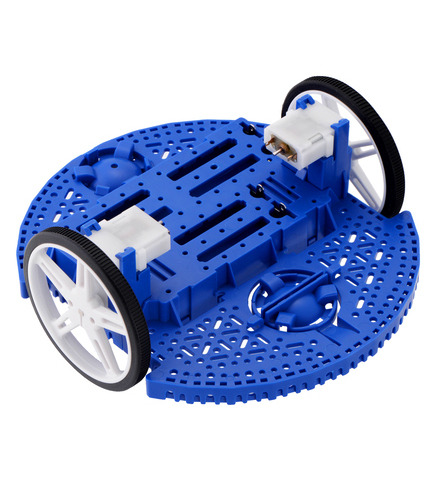
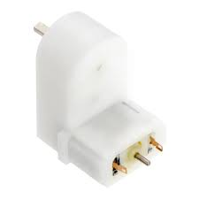
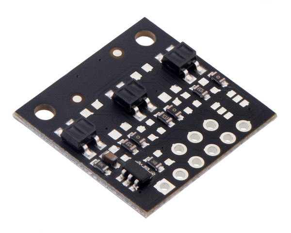
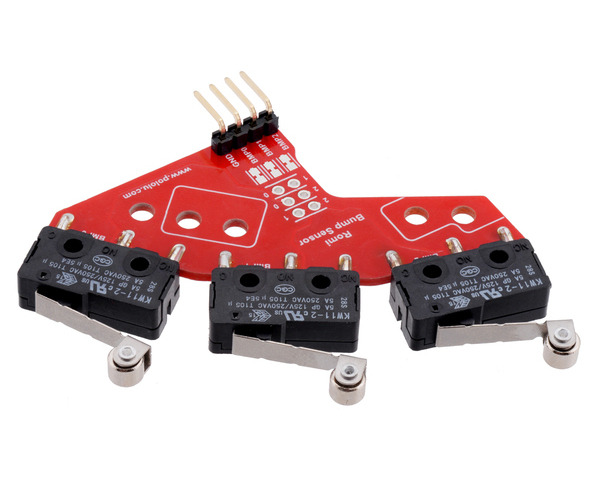
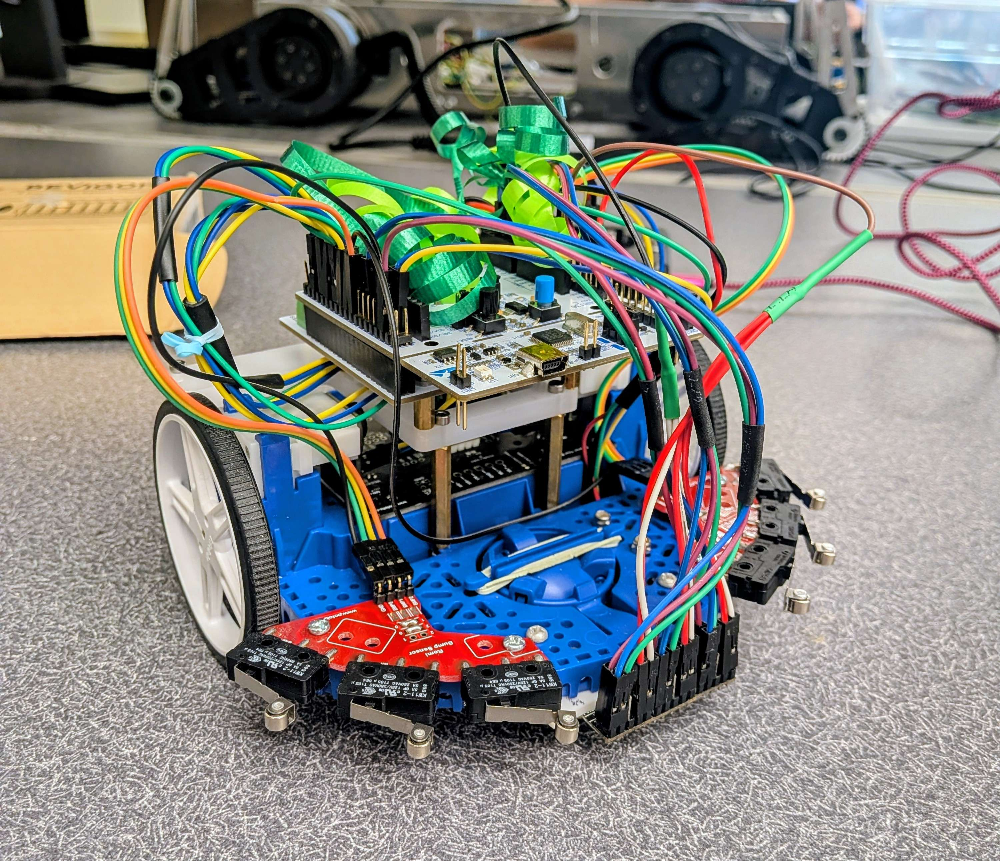

# Mechanical Design

In this project, we designed and assembled a Romi robot capable of navigating an obstacle course autonomously. The system is built on the Romi chassis frame, which serves as the foundation for mounting all sensors and drive components. We focused our mechanical design on integrating sensing and actuation components in a way that allows the robot to reliably detect the line, respond to obstacles, and move in a controlled and predictable manner.

&#x20; 

The main components of our mechanical system include a differential drive system using two motors, quadrature encoders, multiple IR reflectance sensor arrays for line detection, and bumper switch assemblies for obstacle detection.

#### Drive System

We use a differential drive configuration with one motor on each side of the robot. By independently controlling the left and right motors, we can move forward, turn, and rotate in place, allowing for precise maneuvering throughout the obstacle course.

Each wheel is driven by a 120:1 gearmotor, which provides sufficient torque and moderate speed for controlled motion. The gear reduction helps us achieve smooth acceleration and reliable movement, especially during turns and obstacle interactions.

&#x20; 

Encoders attached to each motor allow us to measure position and velocity, which we use in our control system to track distance and regulate speed.

#### Line Sensor Arrays

To follow the track, we use three IR reflectance sensor boards, each with three sensing channels, for a total of nine sensing elements. These sensors detect changes in surface reflectivity, allowing us to distinguish between the black line and the white background.

&#x20; 

We mounted the sensors near the front underside of the robot and positioned them close to the ground to maximize sensitivity. The sensor boards were first hot glued to a custom 3D-printed mount, which was then attached to the chassis using nuts and bolts. By distributing the sensors across the width of the robot, we are able to estimate the position of the line relative to the robot and adjust our motion accordingly.

This arrangement allows us to compute a centroid of the line position and implement smooth line-following behavior.

#### Bump Sensors

To detect obstacles, we use bumper switch assemblies mounted on both the left and right sides of the front of the robot. Each side contains three mechanical switches, giving us a total of six bump sensors. The switch assemblies were attached to the chassis with nuts and bolts.

&#x20; 

These switches are activated when the robot makes contact with an object. Because the switches are distributed across the front of the robot, we can determine which side of the robot encountered the obstacle based on which sensors are triggered.

This allows us to implement different recovery behaviors depending on how the robot collides with an obstacle.

#### Summary

Overall, our mechanical design combines sensing and actuation in a compact and effective layout. By integrating multiple sensor systems with a differential drive platform, we created a robot that can reliably detect its environment and navigate the obstacle course.

&#x20; 

