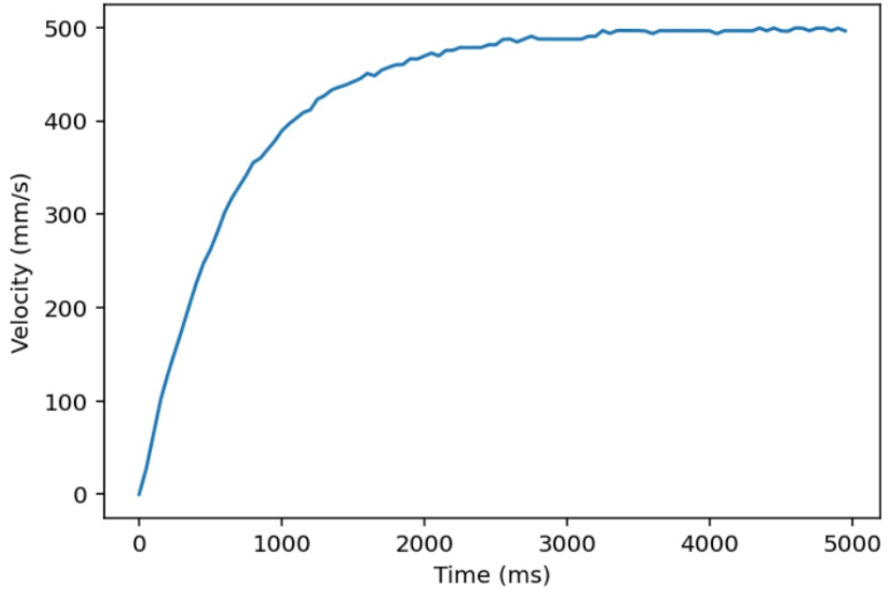
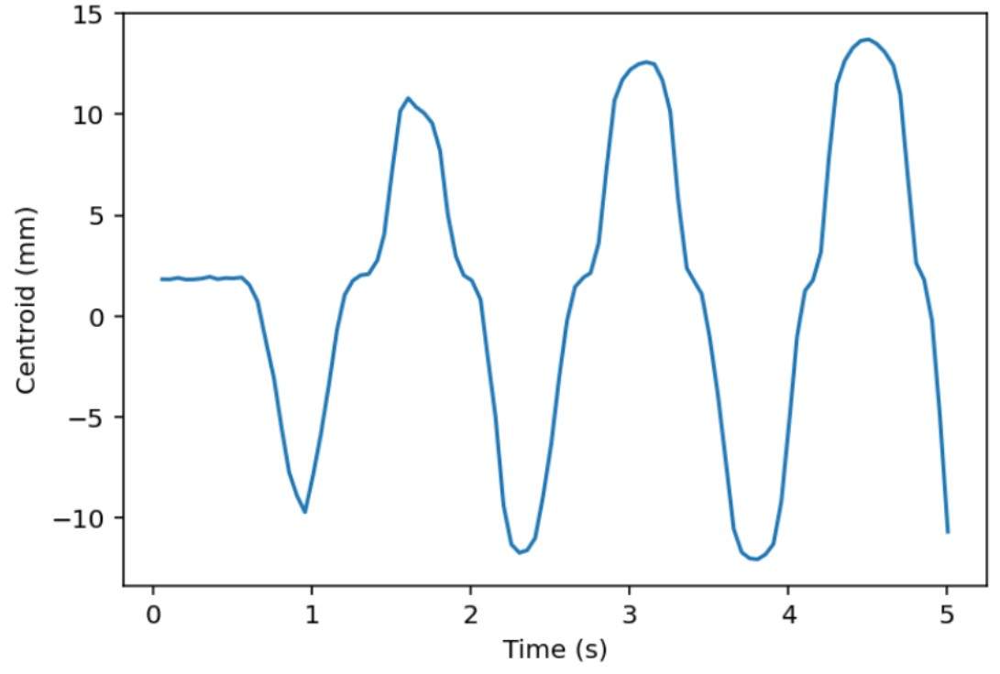
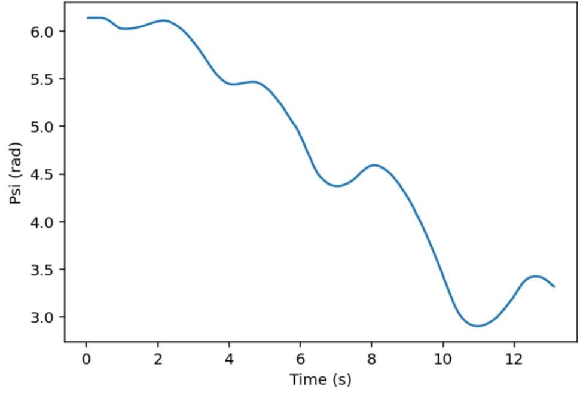

# Results and Testing

Testing for our Romi was continuous throughout the full 10-week development process. Rather than separating building and validation, we tested each hardware component and software task as it was implemented. Our workflow followed a general progression: motor characterization, controller tuning, line following, and finally IMU-based state estimation. 

We began with motor testing using step responses to understand system behavior. These tests allowed us to estimate time constants and tune controller gains to achieve a fast, stable response to velocity commands. 

### Example Graph of Starboard Motor Step Test 

&#x20;  

After integrating the IR sensors, we developed and tested our line-following system using a printed black ring the robot was coded to follow. This stage required much iteration, as performance depended heavily on both gain tuning and reliable wiring. To better understand what the robot was actually “seeing,” we logged and plotted the centroid calculated by the sensors over time. These plots were especially useful for separating hardware issues from control issues, which helped us debug much more efficiently. 

### Example Graph of Centroid Logging During Line Following 

&#x20;  

With the addition of the IMU, testing became more interactive and physically intuitive. The sensor is highly sensitive to small changes in orientation and rotation, so we validated its performance by manually rotating and tilting the robot while monitoring outputs. We also plotted heading versus time as the robot moved, allowing us to compare measured orientation with expected motion and verify overall accuracy and usability for state estimation.. 

### Example Graph of Heading Over Time 

&#x20;  

In the final stage, all subsystems were integrated and tested on the full obstacle course. This required coordinating motor control, line following, state estimation, and bump sensing into a single cohesive system. The course emphasized both speed and repeatability, forcing us to refine not just individual components but their interactions. 

Our testing process became highly iterative. When an issue appeared—such as inconsistent bump sensor readings—we would step away from the full system and isolate the problem through targeted, focused tests (such as printing raw sensor values or running short movements). After resolving the issue, we returned to full-course testing and repeated the process. By repeating this cycle, our Romi gradually improved from partial completion to consistently finishing the course multiple times in succession. 

Through this process, Romi evolved from a collection of loosely working subsystems into a cohesive and reliable robot, capable of completing the course consistently and with confidence. 

