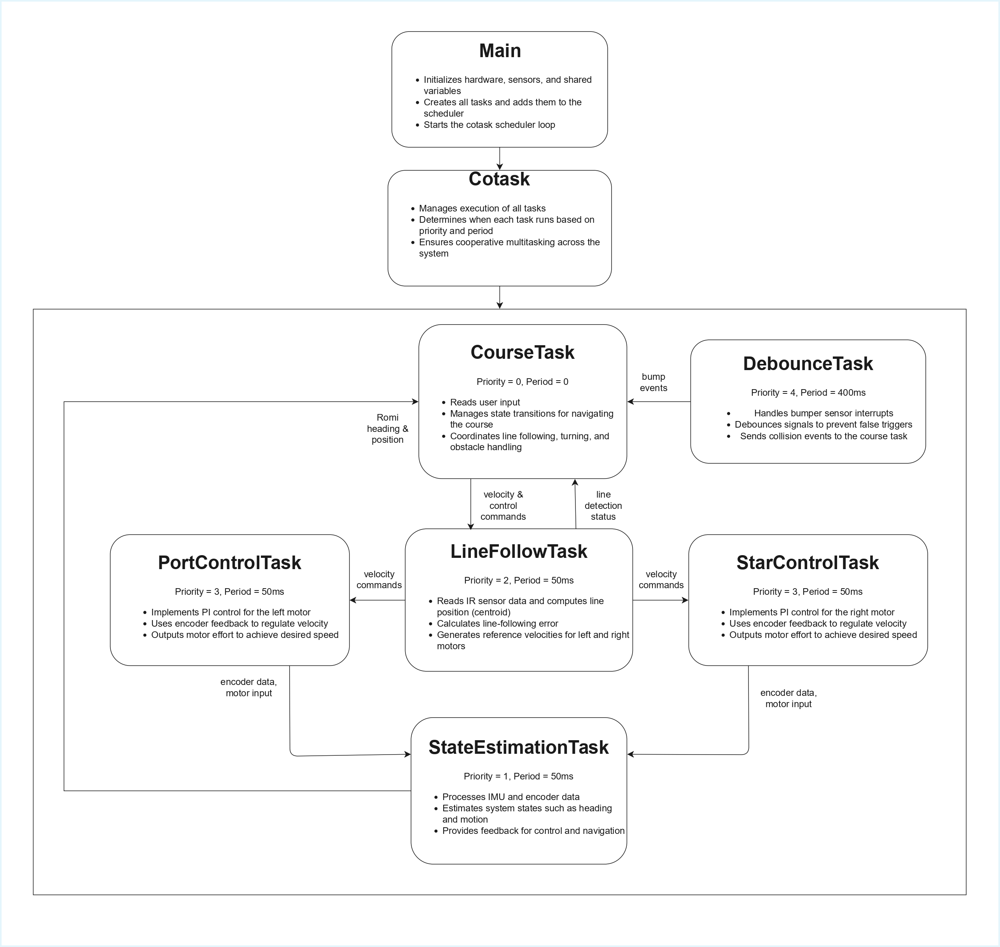

# Software 
### Overview

Our software was organized as a cooperative multitasking system running on the Nucleo microcontroller. The program is split into three main parts: hardware drivers, the main program setup, and the task-level control logic. This structure allowed us to separate low-level hardware access from higher-level robot behavior, making the code easier to debug, tune, and expand. 

The software coordinates line following, motor velocity control, state estimation, obstacle handling, and course navigation. At the top level, the main program creates all hardware objects, allocates the shares and queues used for communication, constructs each task object, and adds those tasks to the provided scheduler.

##### Task Diagram and Communication
The diagram below shows the overall software task structure and communication flow between the major tasks in the system.

&#x20;  

The task diagram above shows the flow of information between tasks. Below is a list of the shares and queues used for communication during the obstacle course as a reference table.

| Variable Name | Data Type | Purpose | Tasks |
|--------------|----------|--------|------|
| GoPort | uint8 (Share) | Flag to enable/disable port motor control | Course ↔ PortControl |
| GoStar | uint8 (Share) | Flag to enable/disable starboard motor control | Course ↔ StarControl |
| GoLine | uint8 (Share) | Command buffer for line-following behavior | Course ↔ LineFollow |
| GoEst | uint8 (Share) | Enables state estimation task | Course ↔ StateEst |
| white_flag | uint8 (Share) | Indicates line sensors detect mostly white | LineFollow → Course |
| KP | float (Share) | Proportional gain for motor PI control | Course → MotorControl |
| KI | float (Share) | Integral gain for motor PI control | Course → MotorControl |
| v_ref | float (Share) | Base reference velocity | Course → LineFollow |
| v_port | float (Share) | Port motor velocity command | LineFollow → PortControl |
| v_star | float (Share) | Starboard motor velocity command | LineFollow → StarControl |
| KP_line | float (Share) | Gain for line-following controller | Course → LineFollow |
| s_port | float (Share) | Port wheel displacement (mm) | MotorControl → StateEst |
| s_star | float (Share) | Starboard wheel displacement (mm) | MotorControl → StateEst |
| u_port | float (Share) | Port motor voltage input | MotorControl → StateEst |
| u_star | float (Share) | Starboard motor voltage input | MotorControl → StateEst |
| V_batt | float (Share) | Measured battery voltage | MotorControl → Course |
| BumpFlag | uint8 (Share) | Indicates bumper event occurred | DebounceTask → Course |
| psi | float (Share) | IMU yaw angle | StateEst → Course |
| BumpExtIntQ | uint8 (Queue) | Queue of triggered bump events | DebounceTask → Course |

### Drivers

We wrote several hardware interface drivers so that the rest of the code could interact with the robot in a simplified manner. These drivers handle the motors, encoders, line sensors, and IMU. The motor driver class configures the PWM, direction, and sleep pins and provides methods to enable, disable, and command effort to each motor. This keeps the motor control task independent from the low-level pin operations. 

The encoder driver configures timer channels in encoder mode and computes both wheel position and velocity from the quadrature signals. It also handles timer overflow and underflow so the accumulated position remains continuous during motion.

For line sensing, we implemented both a Sensor class for a single three-channel board and a Sensors wrapper class that combines all three boards into one nine-sensor array. These classes handle ADC sampling, black/white calibration, normalization, and centroid calculation. This arrangement allowed the line-following task to work with a clean centroid value instead of raw ADC readings.

We also wrote an IMU driver for the BNO055, which manages device initialization, reset, calibration coefficient handling, and data reads over I2C. The state estimation task uses this driver to obtain heading and yaw-rate information.

### Main

The `main.py` file serves as the system entry point. It initializes the serial interface, imports all task and driver modules, defines the observer matrices, and creates the hardware objects for timers, motors, encoders, sensors, bumpers, and the IMU. It then creates every share and queue used by the multitasking system and instantiates each task object with the required dependencies. Finally, it appends all tasks to the scheduler with their priorities and periods before entering the main scheduling loop. The scheduler implementation in `cotask.py` was provided to us, and we used it to run our custom tasks according to priority and timing.

### Tasks

Our robot behavior is implemented through several cooperative tasks, each responsible for a different subsystem. This approach allowed us to divide the overall problem into smaller, more manageable pieces while still coordinating them through shares and queues.

The two motor control tasks are instances of the same PI_control_task class, one for the port motor and one for the starboard motor. Each task reads encoder feedback, compares measured velocity to the reference value, and applies proportional-integral control to compute a motor effort. These tasks also estimate motor voltage, track wheel displacement, and optionally log step-response data.

The line-following task processes the nine-sensor IR array and computes a centroid representing the line position. It uses this centroid to compute a steering correction and then updates the left and right wheel reference velocities accordingly. It also manages black and white calibration and can log centroid data during operation.

The state estimation task combines motor and IMU information to update an observer-based estimate of the robot state. It reads motor inputs, wheel displacements, heading, and yaw rate, applies the discrete-time observer matrices to update the state estimate, then puts the needed variables into different shares. 

The bumper interrupt task handles bump events and debouncing. Its purpose is to prevent repeated false triggers when the robot contacts an obstacle, while still communicating valid bump events to the course logic through a queue and a flag. This task supports more reliable obstacle detection during autonomous navigation.

The highest-level behavioral task is the obstacle course task. This task implements the finite-state machine that sequences the robot through the course. It manages line-following segments, turns, parking maneuvers, cup displacement, wall interactions, and finish behavior by commanding the lower-level tasks through shared variables and reading back feedback such as heading, displacement, white/black flags, and bump events. Below a drawing of the finite state machine of the obstacle course task.

&#x20;  

### Summary

Overall, our software was structured to separate hardware access, system setup, and task-level behavior into clear layers. The driver files provide reusable interfaces to the hardware, `main.py` integrates the entire system, and the cooperative tasks implement the robot’s control and navigation logic. This modular structure made it easier for us to debug subsystems independently and then combine them into a complete autonomous robot.

# Control System

We implemented a closed-loop control system to enable stable navigation of the obstacle course. The robot uses IR reflectance sensors to detect the position of the line and computes a centroid from the resulting data, which is used to determine a line position error. This error is used to adjust the reference velocities of the left and right motors, allowing the robot to steer back toward the center of the track when deviations occur.

To ensure accurate motion, we control each motor independently using a proportional–integral (PI) controller. The desired wheel velocities are compared to the actual velocities measured by the quadrature encoders, and the resulting error is used to compute control outputs. The proportional term provides immediate correction, while the integral term reduces steady-state error, allowing for smooth and stable velocity tracking.

Encoder feedback continuously updates the system, ensuring that commanded velocities are achieved and that the robot responds effectively to changes in the environment. Together, the line-following controller and motor control loops allow the robot to maintain accurate trajectory tracking and reliable performance throughout the course.

The diagram below shows the overall control architecture of the system. The reference velocity is modified by the line-following controller based on sensor input, and the resulting left and right reference velocities are regulated using PI control loops with encoder feedback.

&#x20;  

