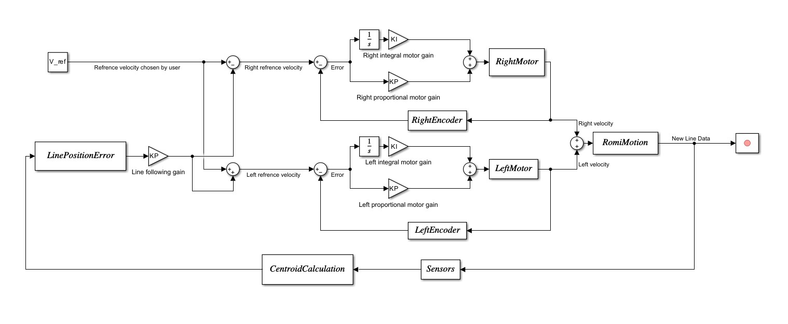

# Software and Control System

ipsum

#### Software

ipsum

#### Control System

We implemented a closed-loop control system to enable stable navigation of the obstacle course. The robot uses IR reflectance sensors to detect the position of the line and computes a centroid from the resulting data, which is used to determine a line position error. This error is used to adjust the reference velocities of the left and right motors, allowing the robot to steer back toward the center of the track when deviations occur.

To ensure accurate motion, we control each motor independently using a proportional–integral (PI) controller. The desired wheel velocities are compared to the actual velocities measured by the quadrature encoders, and the resulting error is used to compute control outputs. The proportional term provides immediate correction, while the integral term reduces steady-state error, allowing for smooth and stable velocity tracking.

Encoder feedback continuously updates the system, ensuring that commanded velocities are achieved and that the robot responds effectively to changes in the environment. Together, the line-following controller and motor control loops allow the robot to maintain accurate trajectory tracking and reliable performance throughout the course.

The diagram below shows the overall control architecture of the system. The reference velocity is modified by the line-following controller based on sensor input, and the resulting left and right reference velocities are regulated using PI control loops with encoder feedback.

&#x20;  

